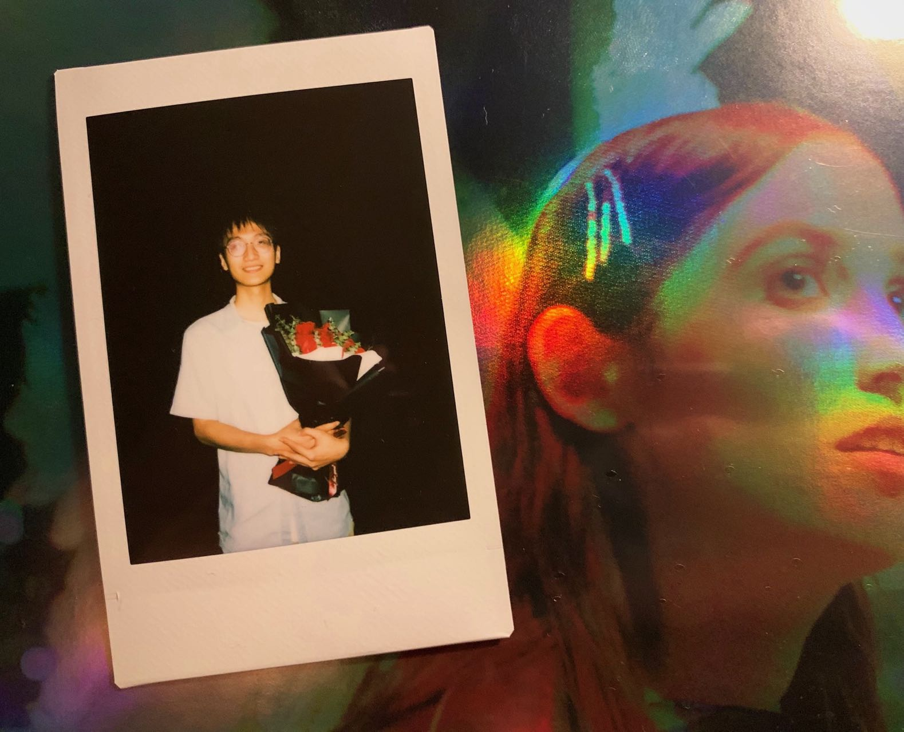

## Introduction

 Hello, everyone! I'm Aojie Yin from Xi'an, Shaanxi Province, China. I'm currently a first-year master's student in Digital Humanities. In my free time, I enjoy listening to indie music and collecting vinyl records. :)  

  Digital Humanities aims to solve research problems in humanities and social sciences with novel computational methods, and for studying digitalization as a phenomenon. It is based on a mixed methods approach that combines research questions, for example, from book and intellectual history and methodologies derived from data science. 

## Find me on

[LinkedIn](https://www.linkedin.com/in/aojie-yin-403119303), [GitHub](https://github.com/aojieyin)

## Contact

My email address: [aojie.yin@helsinki.fi](aojie.yin@helsinki.fi) 

## CV

Here is my [CV](https://www.overleaf.com/read/qkgcsgwmhnrs#0408b8).

## Courses I've Taken

* [**Command-Line Tools for Linguists**](https://studies.helsinki.fi/courses/course-implementation/hy-opt-cur-2425-261401a1-c550-4436-91b9-7edf4a1a3b57/KIK-LG221), fall 2024  

* [**Programming for Digital Humanities**](https://studies.helsinki.fi/courses/course-implementation/hy-opt-cur-2425-d85cca5c-0a41-4332-9f2b-5f8d82d602c9/LDA-H511), fall 2024

* [**Elements of Digital Humanities**](https://studies.helsinki.fi/courses/course-implementation/hy-opt-cur-2425-8c84ad80-7fa3-415e-b7d1-f0d1fc2bb236/LDA-H304), fall 2024

* [**Introduction to Linguistic Diversity and Digital Humanities**](https://studies.helsinki.fi/courses/course-implementation/hy-opt-cur-2425-9df97501-21e6-4b8d-9de4-e91303f2ff71/LDA-301), fall 2024    

## Projects

[**Command-Line Tools Course Final Project**](https://github.com/aojieyin/aojieyin.github.io), October 2024  

In this project, I created a personal webpage using GitHub Pages and Jekyll. The webpage includes a self-introduction, contact information, a list of courses I’ve taken, projects I’ve completed, and other related content.

## Misc. 

Here is my [vinyl account](https://www.instagram.com/yaj_adele?igsh=N200bG8wdWlibWJr&utm_source=qr) in Instagram if you're interested. :)  

This is the cover of one of my favorite albums, _모호함 속의 너 (Nebulous You)_. It's a beautiful blend of shoegaze and dream pop by Korean indie artist [Della Zyr](https://dellazyr.bandcamp.com/).  

  

